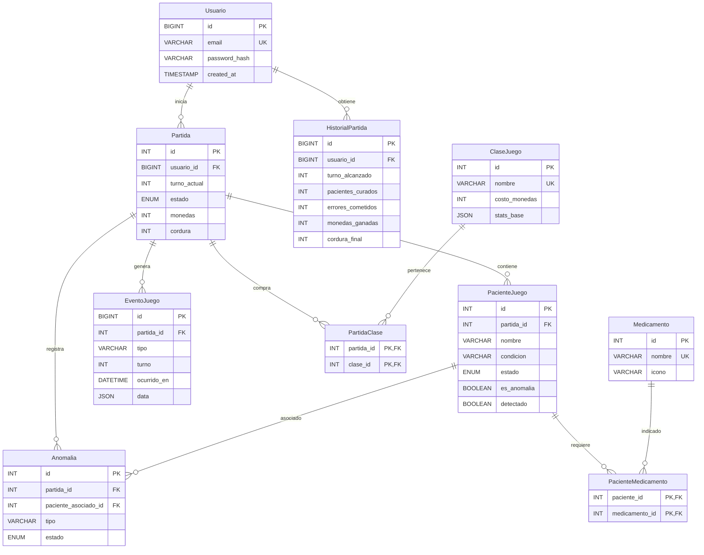

# Diagrama entidad-relación

Este diagrama corresponde al esquema implementado por los scripts SQL del proyecto. Puede pegarse en cualquier visor compatible con Mermaid.

Las tablas puente `PacienteMedicamento` y `PartidaClase` representan relaciones muchos a muchos. `HistorialPartida` conserva el resultado final sin mezclarlo con el estado mutable de una partida activa.
