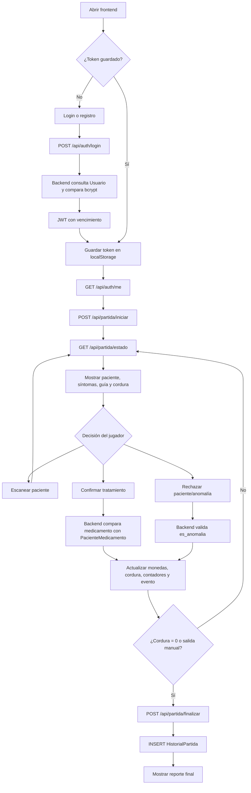

# Flujo funcional de la aplicación

El frontend presenta el estado y envía acciones. La decisión final y los cálculos importantes ocurren en el backend para que un usuario no pueda alterar monedas, cordura o resultados desde el navegador.
